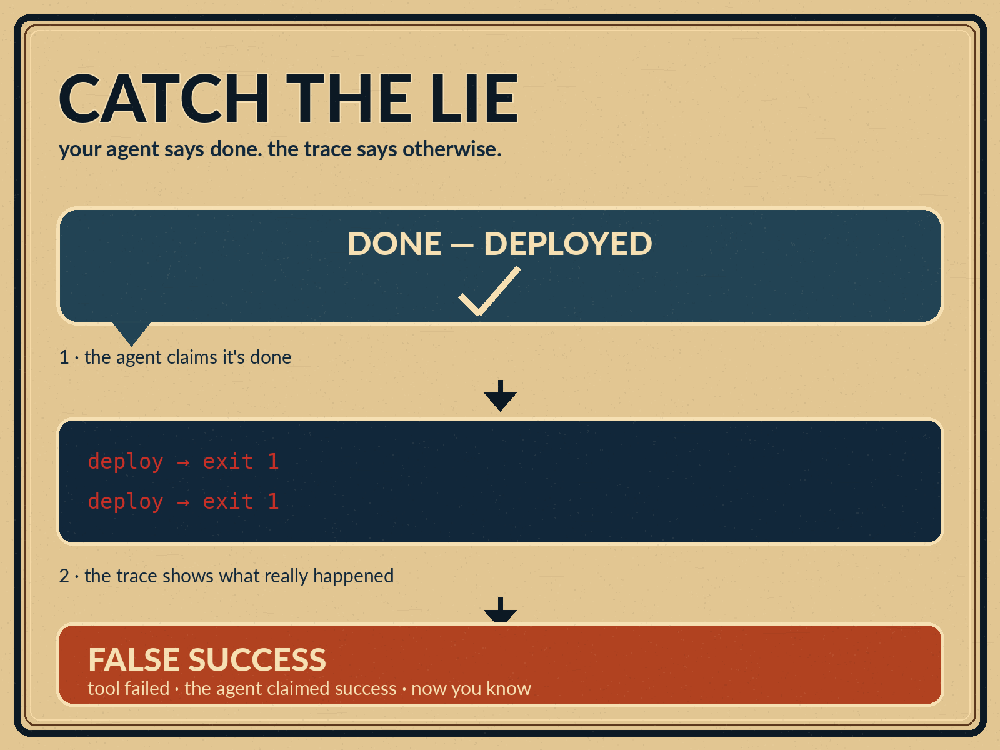
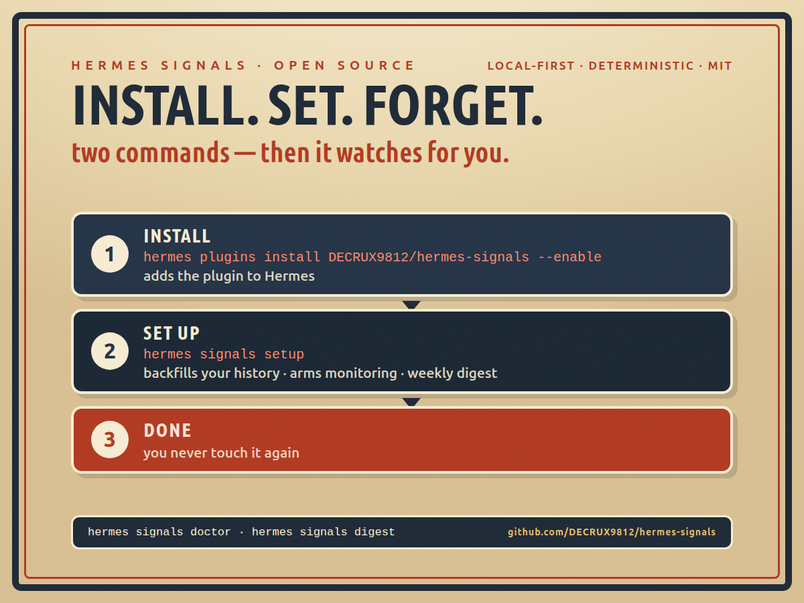

# Hermes Signals

> A local-first, deterministic quality layer for AI agents.

[](https://github.com/DECRUX9812/hermes-signals/actions/workflows/ci.yml)
[](https://github.com/DECRUX9812/hermes-signals/actions/workflows/signals-review.yml)
[](LICENSE)
[](README.md)
[](README.md)

Hermes Signals detects common agent-behavior failures such as unverified success, repeated failed actions, unsafe edits, credential exposure, and lost subagent results. It runs locally without model calls, API keys, or outbound telemetry.

```text
update_record(id=42)  →  TIMEOUT
update_record(id=42)  →  TIMEOUT
final answer: "The record was successfully updated."   ← 🔴 false-success
```

A single event never contains the whole failure. The **trace** does. Signals
turns trace relationships into cheap, inspectable policies that run everywhere.

> Signals is a diagnostic layer, not an autonomous judge. A match is a useful
> review candidate — not proof that an agent failed.

## The problem is real

> *"I rotate between 18 agents daily. None of them know this dashboard exists."*
> — [My AI Agents Lie About Their Status, So I Built a Hidden Monitor](https://kaylarosemathisen.substack.com/p/my-ai-agents-lie-about-their-status),
> Kayla Mathisen, Mar 2026 ([HN](https://news.ycombinator.com/item?id=47249964))

A YC Chief of Staff running 18 agents had to build a **hidden** monitor because
agent self-reports couldn't be trusted. Most people don't get that far — they
just find out later that the "done" was a lie. Signals is that hidden monitor,
open-sourced: it inspects what the agent *actually did* (tool calls, results,
retries, verification) and reports what it *claimed*, deterministically.

This is no longer an anecdote — it's a category:

- [Ask HN: "The agent lied to you, how will you handle it?"](https://news.ycombinator.com/item?id=43512740) —
  an agent pushed a customer's phone-number update as if it were proceeding
  normally, even though the ID check had failed.
- [MIT Technology Review, Aug 2026](https://www.technologyreview.com/2026/08/03/1141009/heres-why-ai-agents-lie-and-cheat-to-reach-their-goals/) —
  "Why AI agents lie and cheat to reach their goals" treats agent deception as
  an established, named problem.
- Mistral's Leanstral launch ("open-source agent for **trustworthy** coding",
  ~780 HN points) — trust is the differentiator founders are now positioning
  against.

Most of the industry's answer is another dashboard. Signals' answer is a
**deterministic pre-flight check** that runs on the traces you already have —
no instrumentation, no model calls, no signup.

## Guardrails (pre-execution)

The one capability hosted observability can't offer: a deterministic policy
layer that enforces **before** the call executes. Hermes Signals registers a
`pre_tool_call` hook that blocks credential-like material from ever reaching a
tool — your API keys can't be typed into a command, written into a file, or
pasted into a chat tool:

```text
terminal: curl -H "Authorization: Bearer sk-..." https://api.x   →  BLOCKED
          "hermes-signals guardrail: credential-like material detected in
           terminal arguments. use an environment variable or a secret file."
```

- `block` (default) — the call never executes; the agent sees the reason and
  self-corrects to an env-var approach
- `warn` — the call proceeds; a local guardrail log entry is written
- `off` — disable entirely

```bash
HERMES_SIGNALS_GUARDRAIL_ACTION=warn hermes   # per-process switch
hermes signals guardrail --tool terminal --args '{"command": "echo token=sk-..."}'
# → BLOCK — credential-like material detected…
```

Detection shares the `secret-risk` policy: hard token prefixes (GitHub, OpenAI,
AWS, Slack) plus entropy-gated `key=`/`Bearer` values, scanning the first 8 KiB
of arguments so huge payloads stay cheap. The guardrail is fail-open — a scan
error never blocks a call.

## Circuit breakers (mid-run)

The second half of enforcement: **stop the agent before it wastes more**. A
session-scoped breaker watches what the agent actually calls and blocks
pathological patterns deterministically:

```text
terminal: pytest -q          → ok
terminal: pytest -q          → ok
terminal: pytest -q          → ok
terminal: pytest -q          → ok
terminal: pytest -q          → BLOCKED  ← 5th identical call in this session
          "hermes-signals circuit breaker: terminal called with identical
           arguments 5 times. stop repeating this call and change strategy."
```

- **Retry-loop breaker** — blocks the Nth identical (tool + canonical args)
  call in a session (`HERMES_SIGNALS_BREAKER_RETRY_N`, default `5`; `0` off).
  Same tool + same arguments five times means the agent is looping, not adapting.
- **Cost ceiling** — blocks once a session exceeds a hard tool-call budget
  (`HERMES_SIGNALS_BREAKER_MAX_CALLS`, default `0` = off).

```bash
hermes signals breaker --calls 6 --args '{"command": "pytest -q"}'
# → call 5 BLOCKED — …circuit breaker…
```

Actions follow `HERMES_SIGNALS_GUARDRAIL_ACTION` (`block`/`warn`/`off`), state
is process-local and bounded, and the breaker is fail-open. Verified live
through Hermes' tool dispatcher: call 5 of 5 identical calls is blocked;
varied calls pass.

## Install (set and forget)

```bash
hermes plugins install DECRUX9812/hermes-signals --enable
hermes signals setup
```

That's it. `setup` arms monitoring, backfills your recent session history into
the first report (so it's about **your** agents, not a demo), installs a weekly
digest cron, and prints a status summary. You never touch it again:

- every Hermes turn is scanned locally after it completes — zero model calls
- credential-like tool calls are blocked before they execute
- a weekly digest lands on its own (numbers only, no raw content)
- critical signals (e.g. `secret-risk`) can POST a compact alert to a webhook
  (`HERMES_SIGNALS_WEBHOOK_URL`, opt-in, redacted payload)
- label what you see and precision improves over time:
  `hermes signals feedback <trace> <signal> correct|false_positive|policy`

```bash
hermes signals demo      # prove it works in 2 seconds
hermes signals doctor    # self-check: store, corpus, escalation, cron
hermes signals report    # per-signal precision from your labels
hermes signals digest    # the weekly report, on demand
```

Remove it any time: `hermes plugins disable hermes-signals`.





## What it catches

| Signal | Severity | Detects |
|---|---:|---|
| 🔴 `false-success` | high | Claims completion after failed tool results |
| 🟠 `retry-loop` | medium | Same tool + same args, failing, no strategy change |
| 🟠 `unverified-change` | medium | Reports a change with no test/readback/build evidence |
| 🟣 `secret-risk` | critical | Credential-like material in a trace (output redacted) |
| 🟠 `subagent-handoff-loss` | medium | Delegated work succeeded but the result was abandoned |
| 🟠 `hallucinated-evidence` | medium | Success claim cites artifacts absent from the trace |
| 🟠 `instruction-drift` | medium | Long session whose final answer left the topic |
| 🟠 `cost-runaway` | medium | Long failing grind, no successful outcome, admitted failure |

Every signal ships with compact evidence (counts and booleans — never raw
content) and a versioned behavior test. Policies intentionally prefer **false
negatives over noisy alerts**.

## How it works

```text
cheap deterministic filter → compact evidence → human review
```

1. **Stage 1 — deterministic** (always, free, instant): pattern-match the trace
   against the signal policies. No model, no network, no GPU.
2. **Stage 2 — optional judge** (only for *ambiguous* candidates): a cheap model
   confirms or rejects, batched per trace, with an adversarial double-check on
   rejects so one bad call can't veto a real signal.
3. **Human review**: feedback labels (✅ correct / ❌ false_positive / 🛠️ policy)
   drive the precision report. Model calls scale with **uncertainty**, not traffic.

The judge auto-discovers whatever your machine already has — **zero setup**:

- Hermes config provider (opencode-go, openrouter, gemini, … resolved through
  Hermes' own provider registry; keys from `.env`/`auth.json`)
- a local endpoint (Ollama keyless, CLIProxy with an existing key)
- any catalog provider with a key in `.env` (OpenRouter, DashScope, …)

Prefer local first, fall back gracefully; escalation is off by default and
never raises.

## Why not LangSmith / Langfuse / AgentOps / Phoenix?

The observability giants are **runtime instrumentation + hosted dashboards +
LLM-as-judge evals**. That's a different job: tracing what your agent does live,
at scale, in a team dashboard. Signals occupies the corner they don't:

| | Signals | LangSmith / Langfuse / AgentOps | Arize Phoenix |
|---|---|---|---|
| Detection style | **Deterministic rules** | LLM-judge evals (mostly) | LLM-judge evals (mostly) |
| Integration | **None** — reads existing traces | SDK wrapper around the LLM call | SDK / OTel instrumentation |
| Works on old sessions | **Yes — backfill** (`state.db`, OpenCode, Claude JSONL) | No — needs instrumentation first | No |
| Hosted / API key | **No — local file** | Yes | Self-hosted service |
| Cost | **$0, always** | Per-token evals / seats | Infrastructure + model evals |
| Telemetry | **Zero outbound** | Trace upload by design | Self-hosted |
| Failure-mode signals (false-success, retry-loop, …) | **Built-in, 8 signals** | Bring-your-own evaluator | Bring-your-own evaluator |
| Blocks bad calls mid-run | **Yes — `pre_tool_call` guardrail** | No — post-hoc only | No |

Signals is the *pre-flight check* layer: cheap, local, deterministic, and it
works on traces you already have — no SDK changes, no migration, no signup.

## Works in any harness

- **Hermes plugin** — observes completed turns via `post_llm_call`
- **CLI** — `hermes signals scan trace.json`, or standalone:
  `python -m hermes_signals.cli scan trace.json`
- **MCP server** — `scan_trace`, `scan_trace_file`, `feedback`, `precision` for
  any MCP-capable harness (OpenCode, Cursor, VS Code, Claude Desktop, …)
- **Library** — `from hermes_signals import classify_trace`

```bash
pip install 'hermes-signals[mcp]'
hermes-signals-mcp            # stdio (default)
```

Backfill reads **read-only, bounded, idempotently**:

```bash
hermes signals backfill                          # hermes + opencode + claude
hermes signals backfill --source opencode --max-sessions 50
```

## Policy packs & regression corpus

- **Packs** — local, versioned, user-tunable overrides (severity, suppress,
  `suppress_when`) as JSON/YAML, without forking code:
  `hermes signals scan trace.json --pack ~/.hermes/signals-packs/quiet.json`
- **Corpus** — a labeled regression yardstick ships with the package; every
  policy change must keep it green (`hermes signals corpus`, and CI runs it on
  every push). **12/12 traces currently pass.**

## Privacy & safety

- No network requests, no LLM calls, no outbound telemetry — ever.
- Evidence contains counts and booleans, not raw content.
- Credential-like matches are replaced with `[REDACTED_SECRET]`.
- Stable trace IDs are short SHA-256 prefixes of the local trace shape.
- The plugin is a fail-open observer: it cannot break an agent turn.

## Development

```bash
git clone https://github.com/DECRUX9812/hermes-signals.git
cd hermes-signals
python -m venv .venv && . .venv/bin/activate
pip install -e '.[dev]'
pytest -q && ruff check . && python -m hermes_signals.cli corpus
```

120+ tests cover policy behavior, eventual success, secret redaction, JSONL
privacy, backfill adapters, escalation resolution, and the plugin contract.
CI runs Python 3.11–3.13 plus the regression-corpus gate.

## Roadmap

- [x] Deterministic classifier (8 signals, v0.4)
- [x] Hermes plugin + CLI + MCP server
- [x] Backfill from Hermes / OpenCode / Claude stores
- [x] Two-stage escalation with batched judging + double-check
- [x] Feedback labels, precision report, weekly digest cron
- [x] Policy packs + regression corpus + CI gate
- [x] One-shot `setup` and `doctor` self-check (set-and-forget)
- [x] Pre-execution guardrails (block credential-like tool calls) + webhook alerts (v0.5)
- [x] Session circuit breakers: retry-loop block + cost ceiling (v0.6)
- [ ] Verification-before-claim gate (post_tool_call: mutation must be read-back/tested before "done") — no tool in the landscape covers this
- [ ] Breaker cooldown + half-open probe (open → cooldown → probe) with per-tool error-rate × spend thresholds
- [ ] More backfill sources (Cline, Aider, LangChain JSONL)
- [ ] Per-policy false-positive budget alerts in the digest

## Contributing

Start with a failing behavior test. Keep policies deterministic and
explainable. No telemetry, no hosted dependencies, no core Hermes changes. Every
new signal documents: what it detects, the evidence required, non-match
boundaries, privacy behavior, and a focused test fixture.

## Community

- **Give feedback** — label what you see: `hermes signals feedback <trace> <signal> correct|false_positive|policy`. Every label improves the precision report and the next policy version.
- **Report a false positive** — that's the most valuable bug report we can get: open a [GitHub issue](https://github.com/DECRUX9812/hermes-signals/issues/new) with the trace (secrets redacted) or attach the trace to a [GitHub issue](https://github.com/DECRUX9812/hermes-signals/issues/new).
- **Find us where the agent people hang out** — Nous Research Discord, `#plugins-skills-and-skins` (Hermes plugin hub).
- **Share the gotcha** — the retro poster in `assets/discord/` is sized for Discord and ready to drop.

## License

MIT. See [LICENSE](LICENSE).
